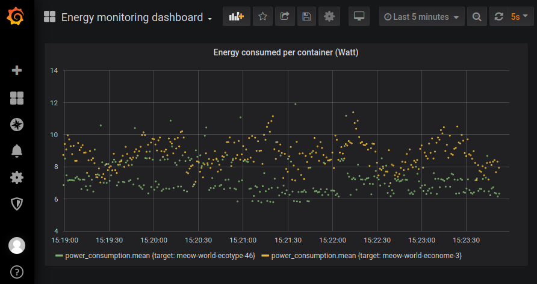

# Energy monitoring service

This service aims to provide an easy-to-deploy stack for energy
monitoring at granularity from machine to container.  This service
deploys [sensors](powerapi.org) that rely on CPU capabilities
to monitor power usage.  This service also uses SmartWatts [1]: "<i>a
lightweight power monitoring system that adopts online calibration to
automatically adjust the CPU and DRAM power models in order to
maximize the accuracy of runtime power estimations of containers</i>".

## Topology

Users define the deployment location of each service comprised in the
energy monitoring stack. [Sensors](powerapi.org) report to
[MongoDBs](www.mongodb.com). A sensor reports to a specific MongoDB
depending on its underlying CPU name. Their exist one formula per CPU
name, so each formula (i.e. SmartWatts) uses a MongoDB to produce
finer grain energy data and export them to
[InfluxDB](www.influxdata.com). An optional [Grafana](grafana.com)
uses InfluxDB hosts to display gathered energy data.

If there are more CPU types than machines to host mongodbs, formulas,
or influxdbs, these are wrapped around available machines. In other
terms, a machine may host multiple containers of the same type.

In the example below, machines with the role `compute` get a PowerAPI
sensor. The rest of machines with the role `control` (possibly the
same set of machines) get databases, SmartWatts, and Grafana.

```python
Energy(sensors=roles['compute'], mongos=roles['control'],
       formulas=roles['control'], influxdbs=roles['control'],
       grafana=roles['control'])
```

The figure below depicts the topology built by this service.

```
#==============#      #=========#       #==============#       #============#       #=========#
# econome-1..3 # ---> # mongo 1 # <---> # smartwatts 1 # ----> # influxdb 1 # <---> # grafana #
#==============#      #=========#       #==============#       #============#       #=========#
                         ^  ^                                        ^
#==============#         |  |           #==============#             |
# ecotype-2..5 #---------'  '---------- # smartwatts 2 # ------------|
#==============#                        #==============#             |
                                                                     |
#==============#      #=========#       #==============#             |
# other cpu(s) # ---> # mongo 2 # <---> # smartwatts 3 # ------------'
#==============#      #=========#       #==============#


<=============>       <=========>       <==============>       <============>       <=========>
    sensors             mongos              formulas             influxdbs            grafana
                 (chosen round-robin)   (1 per CPU type)                             (optional)
```

## Result

After deployment, and with Grafana enabled, you get the result below.
Grafana displays the energy consumed over time by each container
running on sensored machines.




## TODO list

- [X] Add a figure to illustrate the topology.
- [ ] Mount volumes (mongodbs, influxdbs)
- [ ] Explain an example that runs services that use the databases to
  get their energy consumption, i.e., through `hostname_to_influx`.
- [ ] Check internal capabilities of machines and warn or stop
  deployment depending on criticality.
- [ ] Export or backup
- [X] Default dashboard of Grafana
- [ ] Expose environments of containers
- [ ] Provide a summary of deployment, i.e, display the created
  topology

## References

[1] [SmartWatts: Self-Calibrating Software-Defined Power Meter for
Containers](https://arxiv.org/pdf/2001.02505.pdf). Guillaume Fieni,
Romain Rouvoy, and Lionel Seinturier. <i>The 20th IEEE/ACM
International Symposium on Cluster, Cloud and Internet Computing
(CCGrid)</i>, 2020.
